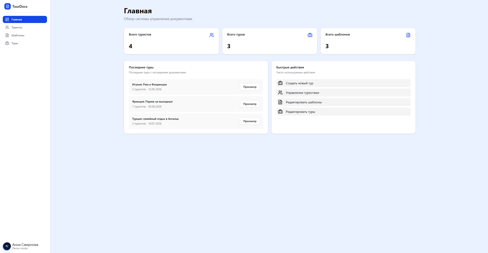
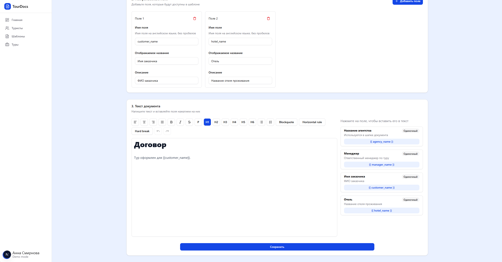

# TourDocs

TourDocs is a full-stack document workflow system for travel agencies. It helps sales teams manage tourists, tours, and document templates, then generate tour-specific `.docx` files from structured data.

## Screenshots





## Highlights

- Tourist management with searchable records
- Tour management with customer and traveler assignment
- Editable document templates with custom fields
- Rich text template editor
- Tour-based value injection into templates
- `.docx` document generation from HTML templates
- Dashboard with quick operational overview

## Stack

- Next.js 16
- React 19
- TypeScript
- Bun
- PostgreSQL
- Drizzle ORM
- Tailwind CSS 4
- Radix UI
- React Hook Form + Zod
- Tiptap
- Handlebars
- `@turbodocx/html-to-docx`
- Docker / Docker Compose

## Flow

1. Add tourists.
2. Create a tour and attach travelers.
3. Select document templates.
4. Fill custom template values.
5. Export generated documents.

## Structure

```text
app/            routes and layouts
components/     UI and feature components
tour/           tour logic
tourist/        tourist logic
template/       template logic
custom-fields/  template field logic
database/       schema and DB integration
lib/            shared utilities
docs/images/    README assets
```

## Run

```bash
bun install
bun run dev
```

Open `http://localhost:3000`.

Production:

```bash
bun run build
bun run start
```
